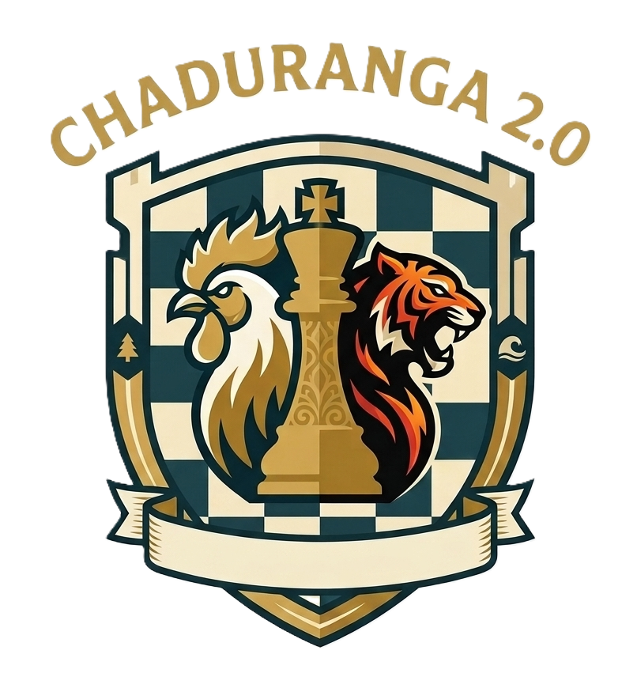

# Chaduranga 2.0

> A modern 12×12 chess variant with Tigers, Roosters, and terrain squares — built as a single-page web app.



---

## Play

Open `index.html` in a modern browser, or run a local server:

```bash
# Python 3
python -m http.server 5500
```

**VS Code:** install the *Live Server* extension → right-click `index.html` → **Open with Live Server**.

Then visit **http://localhost:5500**.

---

## Features

- **12×12 board** with 12 new piece types per side (including Tigers and Roosters)
- **Tigers** — invincible hunters that travel to their designated forest and strike once before leaving the board
- **Roosters** — two-square diagonal leapers, permanently crippled by water
- **Terrain squares** — Forest (Tiger buff), Water (Rooster cripple), Temple (temporary protection)
- **Play Online** — peer-to-peer via [PeerJS](https://peerjs.com/), with 4-character room codes and QR sharing
- **Interactive lessons** — 15 step-by-step tutorials covering every piece, terrain, and tactic
- **3D view** — optional Three.js renderer with biome, day/night, and board-theme switches
- **In-game chat** — emoji reactions and text during online matches
- **Progress tracking** — completed lessons saved to `localStorage`
- **Google Sign-In** — optional auth via Google Identity Services

---

## Project Structure

```
chaduranga-2/
├── index.html          # Main play page
├── learn.html          # Interactive lessons landing + lesson view
├── style.css           # Unified design system
├── script.js           # Game engine + online manager + UI wiring
├── learn.js            # Lesson engine (coach, board, step flow)
├── renderer3d.js       # Three.js 3D board renderer
├── auth.js             # Google Sign-In + guest mode
└── assets/
    ├── logo.png        # Chaduranga logo
    ├── models/         # 3D models (optional)
    ├── pieces/         # Custom piece assets (optional)
    └── textures/       # Board / terrain textures (optional)
```

---

## How to Play

### Standard pieces

Standard chess movement, adapted to a 12×12 board.

### Special pieces

| Piece | Move | Special |
|---|---|---|
| **Tiger** | Teleports to designated forest in 2 diagonal steps | Hunts once on the forest, then leaves. Cannot be captured. |
| **Rooster** | Leaps 2 squares diagonally forward, captures straight ahead | **Water permanently cripples it** — reduced to 1-square hops forever |

### Terrain

| Tile | Effect |
|---|---|
| **Forest** | Designated forests buff a Tiger's hunt (+2 range). Regular forests grant no bonus. |
| **Water** | **Permanently** cripples any Rooster that lands on it. |
| **Temple** | Temporary protection — lost when the piece moves off. |

### Win condition

Checkmate the enemy King, or force a stalemate for a draw.

---

## Tech Stack

- **Vanilla JavaScript** (ES6 classes)
- **PeerJS** for online play
- **Three.js** (r128) for 3D view
- **QRious** for QR code generation
- **Inter** typeface
- No build step required — open and play

---

## Deployment

### GitHub Pages

1. Push to a GitHub repo
2. Go to **Settings → Pages → Source: main branch → / (root)**
3. Your site will be live at `https://<username>.github.io/<repo>/`

### Netlify / Vercel

Drag-and-drop the folder, or connect the repo — no config needed.

---

## License

**Copyright (c) 2026 Amal M and Team. All Rights Reserved.**

This project is **source-available** but **NOT open source**. It is published publicly for viewing, portfolio, and educational inspiration only.

### You MAY NOT:

- Copy, reproduce, or redistribute any part of this code, in source or modified form
- Use this project (in whole or in part) for **any commercial purpose**
- Re-upload, mirror, or host this repository or its contents on any other platform
- Claim this work, design, or code as your own
- Remove, hide, or alter this copyright notice or any author attribution
- Create derivative works intended for public or commercial distribution
- Deploy this project (or any modification of it) as your own product or service

### You MAY:

- View the source code for personal learning and reference
- Fork the repository **only** to submit pull requests back to the original author
- Share a link to the original repository

### Enforcement

Any unauthorized copying, redistribution, or commercial use is a **direct violation of copyright law** and will be pursued accordingly. This includes:

- Filing **DMCA takedown notices** against infringing repositories
- Reporting unauthorized deployments to hosting providers
- Pursuing legal remedies where applicable

The author actively monitors forks, mirrors, and re-uploads.

### Permissions

For commercial licensing, collaboration, or any use not explicitly permitted above, contact the author:

- GitHub: [@amalm-dev](https://github.com/amalm-dev)

---

## Team

Built with a single heart for the **Hackathon** by:

| Name | Role |
|---|---|
| **Amal M** ([@amalm-dev](https://github.com/amalm-dev)) | Developer |
| **Binesh** | Developer |
| **Vismaya** | Developer |
| **Niyas** | Developer |
| **Anandu** | Developer |

❤️

---

## Acknowledgements

- Inspired by classical Indian *Chaturanga*
- Modern chess UX patterns borrowed from chess.com and lichess
- Emoji pieces rendered by the OS native emoji font
